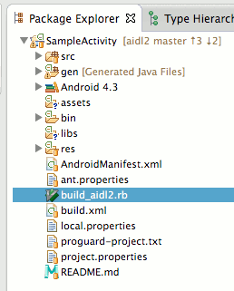
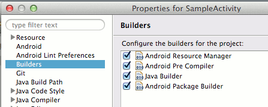
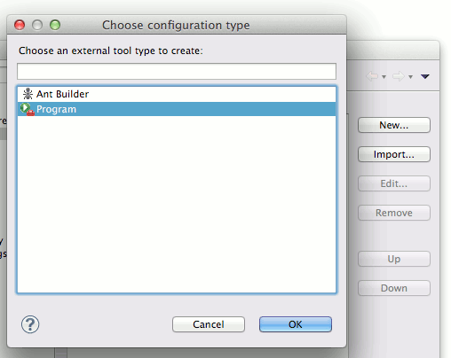
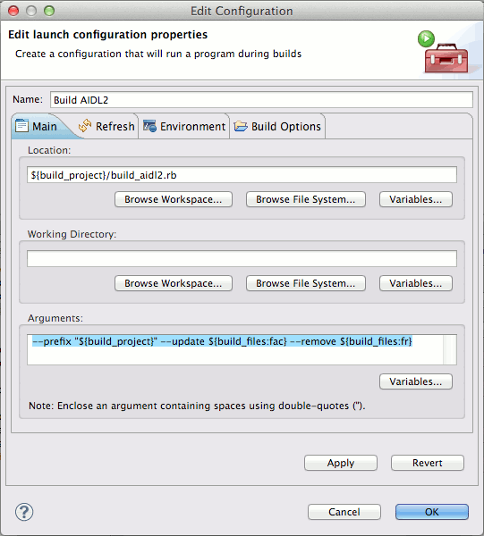
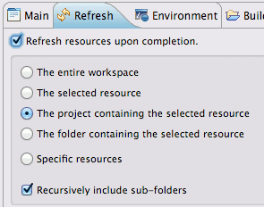
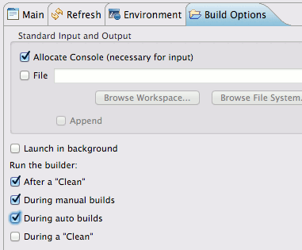
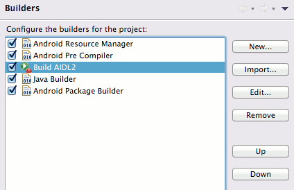

AIDL2: An improved AIDL
=======================

AIDL2 is an extension to [AIDL (Android Interface Definition Language)](http://developer.android.com/guide/components/aidl.html) with the following extra features:

* One modifier (`mainthread`) to ensure a method is run in the main thread, both synchronously and asynchronously.
* One modifier (`localthrow`) to allow NullPointerException not to be caught, to ease debugging in the server side.
* Method overloading is allowed (i.e. you may define multiple methods with the same name).
* More data types are supported by default, e.g. Serializable, SparseBooleanArray, ArrayList of Interface, etc.
* No need to write redundant imports. AIDL2 is more intelligent in guessing whether a type is an interface or parcelable.

Syntax quick glance
-------------------

This is a copy of [ISampleService1.aidl2](sample/src/hihex/aidl2sample/ISampleService1.aidl2) to outline what is being supported in AIDL2.

```java
package hihex.aidl2sample;

import android.util.SparseBooleanArray;
import android.graphics.Point;
import java.util.List;

serializable CustomSerializable;

parcelable CustomParcelable.InnerParcelable;

interface ISampleService1 {
    /** Just a simple method to get started. */
    int simpleSendReceive(int x, int y);
    
    /** We could overload functions. */
    float simpleSendReceive(float x, float y);
    
    /** We could send sparse boolean arrays. */
    int sumKeys(in SparseBooleanArray arr);
   
    /** We could ensure some methods are run in the main thread in the server. */
    oneway mainthread void storeValuesInMainThread(in int[] array);
    
    /** These methods can be run synchronously. */
    mainthread int[] extractValuesInMainThread(out int[] count);
    
    /** AIDL2 automatically recognizes most parcelable types. */
    void swapXy(inout CustomParcelable cp, inout Point point);
    
    /** We can send custom AIDL2 interfaces, even in a list. */
    int[] computeResults(in List<ISampleClient1> clients);
    
    /** We could also write interfaces to a list. */
    void populateClients(out List<ISampleClient1> clients);
    
    /**
     * We could send and receive Serializables. But notice that Serializable is extremely slow, and Parcelable is still
     * preferred. You need to explicitly tell the compiler that a type is serializable.
     */
    CustomSerializable combineSerializables(in java.util.ArrayList<CustomSerializable> css);
    
    /**
     * AIDL2 is not a Java parser, thus cannot determine what is the kind of some complex data type. You can still
     * explicitly mark a type as a Parcelable or Serializable.
     */
    CustomParcelable.InnerParcelable createInnerParcelable(float foo);
}
```

Installation
------------

AIDL2 is designed to be used with Eclipse/ADT. It will support Apache Ant in the near future. 

To use AIDL2, you must first have:

* Ruby (1.8.7 or above)
* Eclipse (only tested on 4.3 Kepler, but lower version should also work)

To install:

1. Download `build_aidl2.rb` from the [Releases](https://github.com/kennytm/aidl2/releases)
2. Place the ruby script to the root of the project.

    
    
3. Go to the "Builders" pane in the project properties.

    
    
4. Click <kbd>New...</kbd>, and then choose "Program".

    

5. In the "Edit Configuration" dialog, put `${build_project}/build_aidl2.rb` into Location and `--prefix "${build_project}" --update ${build_files:fac} --remove ${build_files:fr}` into Arguments.

    

6. In the "Refresh" tab, enable "Refresh resources upon completion", and choose "The project containing the selected resource".

    

7. In the "Build options" tab, enable "During auto builds" in the "Run the builder:" section.

    

8. After closing the dialog, move the new builder between "Android Pre Compiler" and "Java Builder".

    

9. We are done! Eclipse can now automatically compile the AIDL2 interfaces in this project.

Caveats
-------

* While AIDL2 is source-compatible with AIDL, it is not designed to be ABI-compatible with AIDL. That means, a parcel sent from an AIDL client may become garbage when received in an AIDL2 server.
* AIDL2 will not support some obscure features in AIDL e.g. `flattenable` and `rpc`.
* AIDL2 is just a custom external builder, so it will not integrate into the ADT as good as AIDL.

Develop
-------

The following are needed to build `build_aidl2.rb` from scratch:

* Ruby (1.8.7 or above)
* [Ragel](http://www.complang.org/ragel/) (6.8 or above) 

Simply call `rake` to build the file.

License
-------

AIDL2 is released under [GPL v3](gpl-3.0.txt). This covers both the source code and `build_aidl2.rb`. 

**Note**: Part of the Java code generated by `build_aidl2.rb` contains copies of the GPL-ed source code. As a special exception, you may use these copied AIDL2 source code in the output file without restriction from the license of AIDL2.
